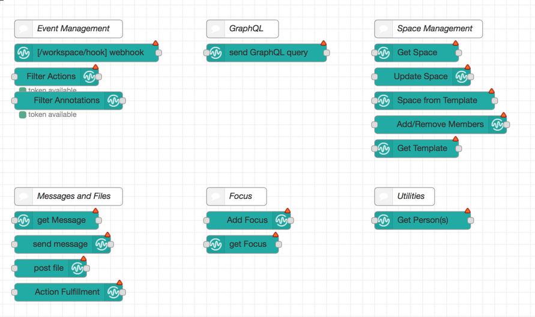
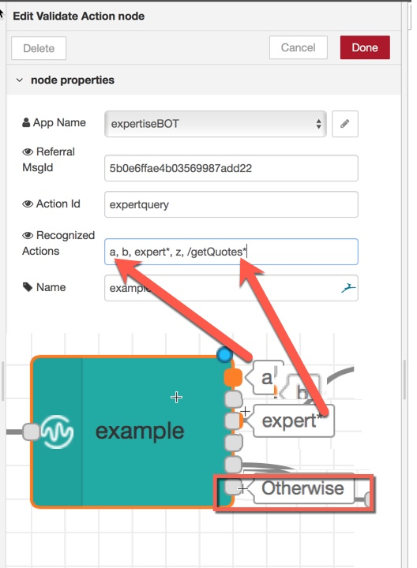

node-red-contrib-wws
=====================

A set of node-red nodes to interact with [IBM Watson Workspace](https://workspace.ibm.com/).

# Purpose
This node is intended to be used for communicating with Watson Workspace APIs using [Workspace Apps](https://developer.watsonwork.ibm.com/docs/get-started/what-can-you-build). Once you have created a Workspace App, you can create the corresponding "NodeRed Configuration node" representing this app.
With these nodes, you have the ability to configure webhooks, to send messages or files to spaces to which the corresponding Workspace App is attached, to execute [graphQL commands](https://developer.watsonwork.ibm.com/docs/developers-guide/graphql-api) and to validate "ActionSelected" annotations.

Here is the list of Nodes currently proposed by this package.

# Installation

## Prerequisites
The following packages are required to be present in node-red prior to this installation
* `"body-parser": "^1.18.2"`
* `"simple-oauth2": "^1.5.2"`
* `"javascript-state-machine":"^3.0.1"`
* `"follow-redirects":"^1.3.0"`
* `"request-promise-native": "^1.0.5"`
* `"request": "^2.87.0"`

## Manual Installation
* In case of manual installation copy the code to the user directory of Node-RED e.g. `/data/node_modules/node-red-contrib-wws`.
* Install the dependencies via npm install and move packages one level up `mv node_modules/* ..´.
* To make Node-RED find the code, define the NODE_PATH environment variable by adding the Node-RED installation directory first, and the user directory second. Here is an example: `NODE_PATH="/usr/src/node-red/node_modules:/data/node_modules"`

# Features
* Credentials node
  * creates a configuration node for a dedicated Watson Work Application, 
  * containing App ID and App Secret, 
  * plus additional OAuth configuration elements
  * Note : **this node is used by all the other nodes**
* webhook node
  * Configure the webhook url
  * converts events into node-red friendly messages
  * shows incoming events on nodes status
  * optionally provides filtering of outputs according to the **msg.type** value of the incoming message
* message node
  * send messages to a space
  * provides a configuration interface (including preview functionality)
  * selection of available spaces
  * availability to upload a profile photo for each app
  * returns response from WWS to msg.payload
* file node
  * selection of available spaces
  * optional usage of a different access token (e.g. from 'Authenticate on behalf of a user')
  * either sends a file (of any kind) or an image (png, jpeg or gif) to a space
* graphQL node
  * static or dynamic GraphQL query 
  * optional usage of a different access token (e.g. from 'Authenticate on behalf of a user')
  * return node-red friendly results.
  * supports **BETA** and **EXPERIMENTAL** APIs
* Validate Action node
  * this is a service node which makes it easy to filter Annotations coresponding to **actionSelected** lenses
  * you can specify multiple **ActionId** (they can come from *custom intents*, from *slash commands*, from *buttons* etc)
  * provides multiple outputs. Each output corresponds to one of the possible **actionId** that the instance of the node supports
  * see 
* Get Templated Space node
  * this node simply retrieves all the information related to a space that was built out of a Template
  * It friendly provides textual representation of **preperties**, **property values** and **status**
* Update Space
  * This node provides a tool to easily update a Space coming from a Template. It allows to easily change the **status** and any of the **properties**.
  * The main charactceristics of this node is that the **names** and the **values** of the **properties** and of the **status** are entered using their textual representation.
    * New Property value are specified using a comma-separated string where each item is in the form of a *name = value* pair
* Space From Template
  * This node provides a tool to easily create a Space from a Template. It allows to easily initialize any of the **properties** coming from the Template and 
    the **initial members**.
  * The main charactceristics of this node is that the **names** and the **values** of the **properties** are entered using their textual representation.
    * New Property value are specified using a comma-separated string where each item is in the form of a *name = value* pair
* Get Template
  * This node provides a tool to easily retrieve all the informations for a Template.
  * This node **ONLY WORKS WITH an AUTHORIZE-AS-USER**, i.e. using the "wwsToken" input parameter
* Add/Remove Members
  * This node provides a tool to easily add or remove Members to or from a Space. More than one member can be added or removed at the same time.
* Get Person(s)
  * This node provides a tool to easily retriev all the details for a set of people.
  * The set of people can be specified as a set of **email addresses** (in the next versions also as "**names**" or "**IDs**") 

   
# Known Issues
* There is an issue with the additional input parameter `operationName` or `variables`. The best workaround is to ignore those additional parameters and stick to the pure graphQL query parameter.